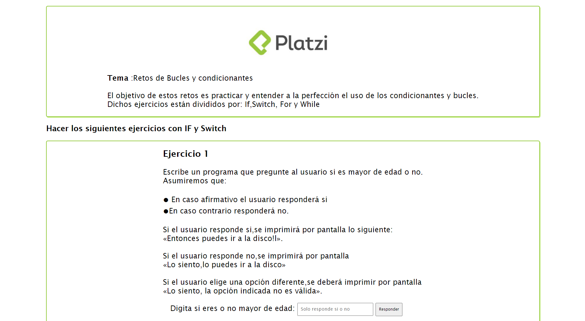

# Challenge Loops

Hola, Soy Juan Pablo, o JuanDevp, o Juagarex, y aquí encontrarás la información sobre los proyectos en los que me divertido, dedico y concentro  
  
Acompañe  a conocer más sobre el grandioso mundo del desarrollo

### Challenge Loops



Aquí encontrarás retos relacionados con estructuras de bucles  en JavaScript como:  


* IF
* IF ANIDADOS
* ELSE IF
* FOR
* WHILE
* SWITCH


## Recomendaciones

Encaso de que querer copiar o usar esta información y código te recomiendo lo siguiente:

Código para clonar con protocoló https:

```text
https://github.com/Juagarex/Reto-Bucles.git
```

Código para clonar con protocoló SSH:

```text
 git git@github.com:Juagarex/Reto-Bucles.git
```

Código para clonar con protocoló Github CLI:

```text
gh repo clone Juagarex/Reto-Bucles
```

### Gracias por ayudarme a mejorar, y recuerda \#nuncaparesdeaprender

Platzi Master 💚

